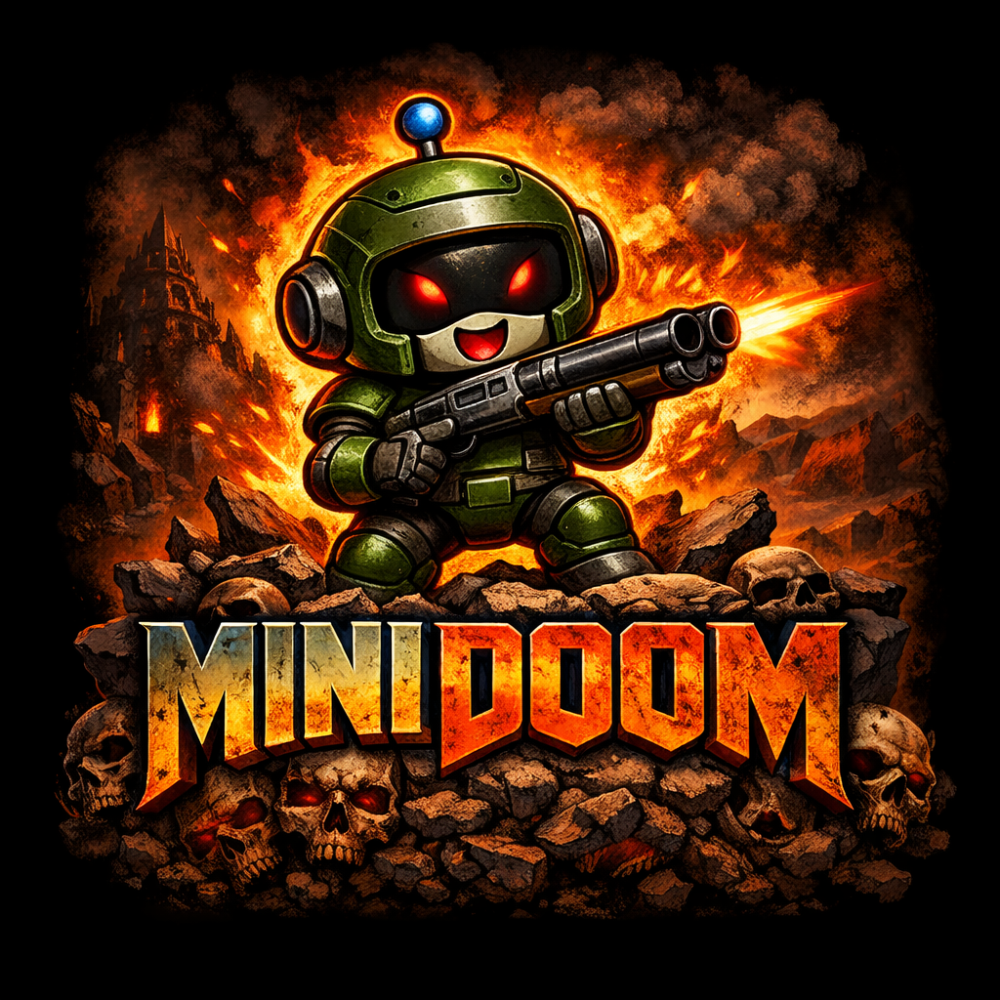

# MiniDoom


MiniDoom is a full MiniLang port of the original DOOM engine codebase, focused on gameplay parity, classic behavior, and native Windows execution.

This project keeps the original DOOM architecture and module split concept, but translates the implementation to MiniLang (`.ml`) with platform-specific runtime bindings where needed (video, audio, input, window handling).
<br clear="right" />

## Project Goals

- Port original DOOM engine logic to MiniLang as faithfully as possible.
- Preserve classic gameplay behavior (movement, combat, AI, doors/switches/triggers, HUD/menu flow).
- Keep rendering semantics close to the original pipeline (BSP, walls, visplanes, sprites, clipping).
- Run as a native Windows executable (`MiniDoom.exe`) built with the MiniLang compiler.

## How This Port Was Built

- The original C/H codebase was mapped module-by-module to MiniLang.
- In most cases, one gameplay/render/system C module is represented by one MiniLang file.
- Data structures (`struct`, enums, tables, globals) were ported explicitly.
- Win32-facing parts (graphics/audio/system) are implemented via native bindings used by MiniLang.
- The build flow is automated with a Python script that also handles EXE icon injection.

## Repository Structure

```text
MiniDoom/
  src/                       # MiniLang game/engine source files
  icons/                     # PNG + ICO assets for EXE icon resources
  tools/
    exe_icon_injector.ml     # MiniLang tool: injects .ico into Windows .exe resources
  build.py                   # Main build script (builds tool + MiniDoom + icon injection)
  LICENSE
  README.md
```

## Prerequisites

- Windows (x64)
- Python 3.10+ (recommended: 3.11+)
- MiniLang compiler (Python implementation):  
  [MiniLangCompilerPy](https://github.com/MiniLangProject/MiniLangCompilerPy)
- A DOOM IWAD file (for example `DOOM.WAD`, `DOOM1.WAD`, `DOOM2.WAD`) for runtime testing

Note: IWAD files are not shipped with this repository.

## Build MiniDoom (Recommended)

Use `build.py` from this repository root.

### Example

```powershell
python .\build.py `
  --compiler "C:\path\to\MiniLangCompilerPy\mlc_win64.py" `
  --std "C:\path\to\MiniLangCompilerPy\std"
```

What this does:

1. Compiles `tools/exe_icon_injector.ml` to `build/tools/exe_icon_injector.exe`
2. Compiles `src/i_main.ml` to `build/MiniDoom.exe`
3. Injects `icons/MiniDoom.ico` into `build/MiniDoom.exe`

Final output:

```text
build/MiniDoom.exe
```

### Useful Build Options

- `--output-dir <path>`: change output directory
- `--skip-icon`: build without icon injection
- `--clean`: remove output directory before build
- `--icon <path.ico>`: use a custom icon file
- `--icon-group <id>` / `--icon-lang <id>`: resource ids for icon injection

## Build MiniDoom Manually (Without build.py)

Compile directly via MiniLang compiler:

```powershell
python C:\path\to\mlc_win64.py `
  .\src\i_main.ml `
  .\MiniDoom.exe `
  -I .\src `
  -I C:\path\to\MiniLangCompilerPy `
  --subsystem windows
```

If you want the EXE icon embedded, build and run the icon injector:

```powershell
python C:\path\to\mlc_win64.py `
  .\tools\exe_icon_injector.ml `
  .\exe_icon_injector.exe `
  -I .\src `
  -I C:\path\to\MiniLangCompilerPy `
  --subsystem console

.\exe_icon_injector.exe .\MiniDoom.exe .\icons\MiniDoom.ico
```

## Running MiniDoom

Example run:

```powershell
.\build\MiniDoom.exe -iwad "C:\Games\DOOM\DOOM2.WAD"
```

If no `-iwad` is provided, the engine uses its internal IWAD search order and loads the first matching file it finds.

## Notes vs Original DOOM

- Core engine behavior targets original DOOM parity while using MiniLang runtime semantics.
- Platform layer is adapted for modern Windows execution.
- Build and tooling are modernized (single Python build script + MiniLang resource tool).

## License

See [LICENSE](./LICENSE).
